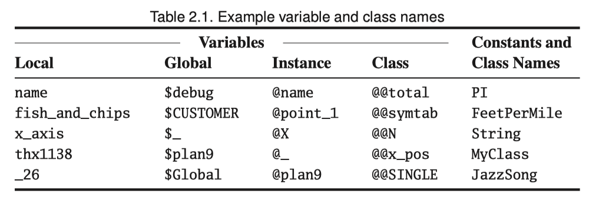
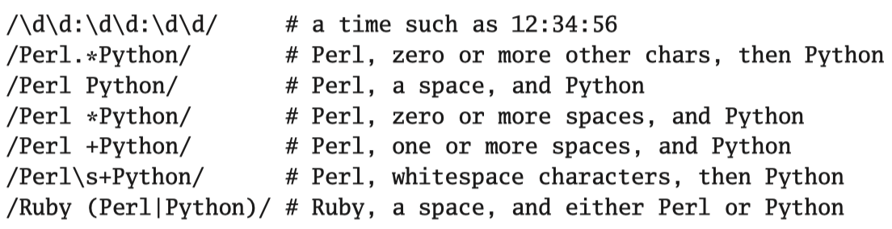
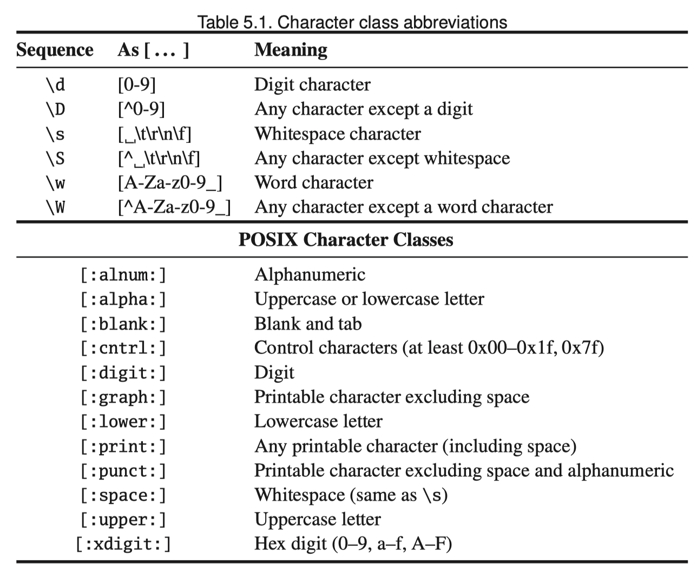

# Table of Content
<!-- TOC -->

- [Ruby is an object oriented language](#ruby-is-an-object-oriented-language)
- [Some baisc Ruby](#some-baisc-ruby)
- [Arrays and Hashes](#arrays-and-hashes)
- [Control Structure](#control-structure)
- [Regular Expressions](#regular-expressions)
- [Blocks and iterators](#blocks-and-iterators)
- [Reading and Writing](#reading-and-writing)

<!-- /TOC -->

# Ruby is an object oriented language
1. In Ruby, you’d define a **class** to represent each of these entities. A class is a combination of state -- **instance variable** (for example, the name of the song) and **instance methods** that use that state (perhaps a method to play the song).

	Methods are invoked by sending a **message** to an object. The message contains the method’s name, along with any parameters the method may need. When an object receives a message, it looks into its own class for a corresponding method. If found, that method is executed.

1. Once you have these classes, you’ll typically want to create a number of **instances** of each.

	In Ruby, these objects are created by calling a **constructor**, a special method associated with a class. The standard constructor is called **new**.

	```ruby
	song1 = Song.new("aaa")
	song2 = Song.new("bbb")
	```

1. invoke a method

	```ruby
	"asdf".length
	"Rick".index("c")
	-1924.abs
	```

	```java
	number = Math.abs(number) // Java code
	```
# Some baisc Ruby


1. Addition of string

	```ruby
	def say_goodnight(name)
	  result =  "Good Night, " + name
	  return result
	end

	puts say_goodnight("John-Boy")
	puts say_goodnight("Mary")
	```

1. Using expression interpolation

	```ruby
	def say_goodnight(name)
	  result =  "Good Night, #{name.capitalize}"
	  return result
	end
	puts say_goodnight("harry")
	```

1. Difference between double quote and single quote

	```ruby
	def say_goodnight(name)
	  result =  'Good Night, #{name}'
	  return result
	end
	puts say_goodnight("Harry")
	```

1. As a shortcut, you don’t need to supply the braces when the expression is simply a global, instance, or class variable

	```ruby
	$greeting = "hello" #global variable
	@name = "Prudence" #instance variable
	puts "#$greeting, #@name"
	```

1. The value returned by a Ruby method is the value of the last expression evaluated, so we can get rid of the temporary variable and the return statement altogether.

	```ruby
	# no return needed
	def say_goodnight(name)
	  result =  "Good Night, #{name}"
	end
	puts say_goodnight("Eason")
	```

1. Name convention in Ruby:
	The first characters of a name indicate how the name is used.
	1. Local variables, method parameters, and method names should all start with a lowercase letter or with an underscore.
	1. Global variables are prefixed with a dollar sign ($), and instance variables begin with an “at” sign (@).
	2. Class variables start with two “at” signs (@@).
	3. Finally, class names, module names, and constants must start with an uppercase letter.

	By convention multiword instance variables are written with underscores between the words,

	Multiword class names are written in MixedCase (with each word capitalized).

	Method names may end with the characters ?, !, and =.
	


# Arrays and Hashes

1. Ruby’s arrays and hashes are indexed collections. Both store collections of objects, accessible using a key. With arrays, the key is an integer, whereas hashes support any object as a key.
2. array literal:

	```ruby
	a = [1,'cat',3.14] #array
	puts a[0]
	a[2] = nil
	puts a
	```
	nil is also an object.

	Ruby index start at 0
1. %w in array

	```ruby
	a = [ 'ant', 'bee', 'cat', 'dog', 'elk' ]
	puts a
	b = %w{ ant bee cat dog elk }
	puts b
	```
	a and b are same array here
1. Hash

	Change the default returning value when a Hash doesn't contain the key we ask.

	```ruby
	inst_section = {
	  'cello' => 'string',
	  'clarinet' => 'woodwind',
	  'drum' => 'percussion',
	  'oboe' => 'woodwind',
	  'trumpet' => 'brass',
	  'violin' => 'string',
	  'aaa' => 123
	}
	puts inst_section['cello']
	puts inst_section['aaa']
	puts inst_section['bbb'] # return nil

	histogram = Hash.new(0)
	puts histogram['key1']
	histogram['key1'] = histogram['key1'] + 1
	puts histogram['key1']
	```

# Control Structure
1. Ruby use **end** to signify the end of a body

	```ruby
	i = 0
	while i<15
	  if i > 10
	    puts "Try again"
	  elsif i == 3
	    puts "you lose"
	  else
	    puts "Enter a number"
	  end
	  i += 1
	end
	```


2. Ruby **statement modifiers** are a useful shortcut if the body of an if or while statement is just a single expression. Simply write the expression, followed by if or while and the condition.

	```ruby
	radiation = 4000

	if radiation > 3000
	  puts "Danger, Will Robinson"
	end

	puts "Danger, Will Robinson" if radiation > 3000
	```

	```ruby
	square = 2
	while square < 1000
	  square = square * square
	  puts square
	end

	square = 2
	square = square * square while square < 1000
	puts square
	```
# Regular Expressions
1. Most of Ruby’s built-in types will be familiar to all programmers. A majority of languages have strings, integers, floats, arrays, and so on. However, **regular expression** support is typically built into only scripting languages, such as Ruby, Perl, and awk.

	This is a shame: regular expressions, although cryptic, are a powerful tool for working with text. And having them built in, rather than tacked on through a library interface, makes a big difference.

2. A regular expression is simply a way of specifying a pattern of characters to be matched in a string. In Ruby, you typically create a regular expression by writing a pattern between **slash characters (/pattern/)**. And, Ruby being Ruby, regular expressions are objects and can be manipulated as such.

3. `/Perl|Python/` or `/P(erl|ython)/`
	The forward slashes delimit the pattern, which consists of the two things we’re matching, separated by a pipe character (|). This pipe character means “either the thing on the right or the thing on the left,” in this case either Perl or Python. You can use parentheses within patterns, just as you can in arithmetic expressions, so you could also have written this pattern as

1. `/ab+c/` matches a string containing an a followed by one or more b’s, followed by a c.

1. Change the plus to an asterisk, and `/ab*c/` creates a regular expression that matches one a, zero or more b’s, and one c.

1. Some example
	

	

1. Use patern. The **match operator =~** can be used to match a string against a regular expression.

	If the pattern is found in the string, =~ returns its starting position, otherwise it returns nil. This means you can use regular expressions as the condition in if and while statements.

	```ruby
	if line =~ /Perl|Python/
  	  puts "pattern found: #{line}"
	end
	```

1. Replace the matched pattern

	```ruby
	line.sub(/Perl/, 'Ruby') # replace first 'Perl' with 'Ruby'
	line.gsub(/Perl/, 'Ruby') # replace every 'Perl' with 'Ruby'
	```

# Blocks and iterators
1. Code blocks: chunks of code you can associate with method invocations, almost as if they were parameters.

	We try to follow what is becoming a Ruby standard and use braces for single-line blocks and do/end for multiline blocks.
1. single line block

	```ruby
	{puts "hello"} # a single line code block
	```
2. multi line block

	```ruby
	do
	  puts "aaa"
	  puts "bbb"
	end
	```
3. yield

	```ruby
	def call_block
	  puts "Start"
	  yield
	  yield
	  puts "End"
	end
	call_block {puts "in the block"}
	```

	give us

	```
	Start
	in the block
	in the block
	End
	```

4. another example

	```ruby
	animals = %w( ant bee cat dog elk)
	animals.each{|animals| puts animals}
	animals.each{|name| print name, " "}
	5.times {print "*"}
	3.upto(6) {|i| print i}
	('a'..'e').each {|char| print char}
	```

5. example

	```ruby
	class Person
	    def initialize( name )
	         @name = name
	    end

	    def do_with_name
	        yield( @name )
	    end
	end

	person = Person.new("Oscar")

	#invoking the method passing a block
	person.do_with_name do |name|
	    puts "Hey, his name is #{name}"
	end

	#invoke the method passing a different block
	person.do_with_name do |name|
	    puts "Hey, his name is #{name.reverse}"
	end
	```
6. eg

	```ruby
	days = ["monday", "tuesday", "wednesday", "thursday", "friday"]
	# select those which start with 't'
	days.select do |item|
	  item.match /^t/
	end
	```

# Reading and Writing
1. **puts** writes its arguments, adding a newline after each.
2. **print** also writes its arguments, but with no newline. Both can be used to write to any I/O object, but by default they write to standard output.
3. Another output method we use a lot is **printf**, which prints its arguments under the control of a format string

	```ruby
	printf("Number: %5.2f,\nString: %s \n",1.23,"hello")
	```
4. input

	```ruby
	line = gets
	print line
	```
