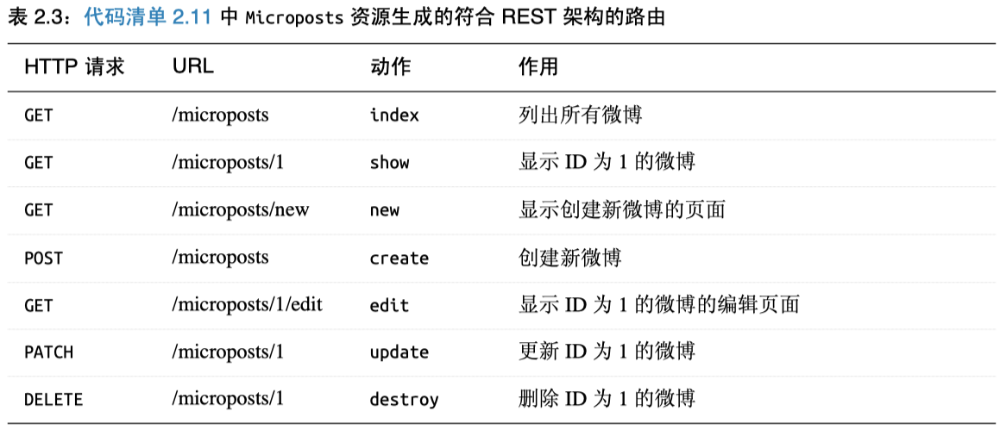
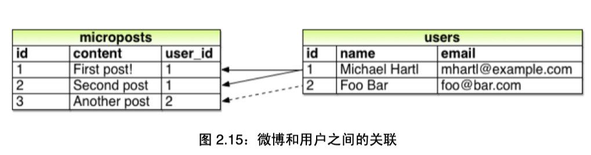
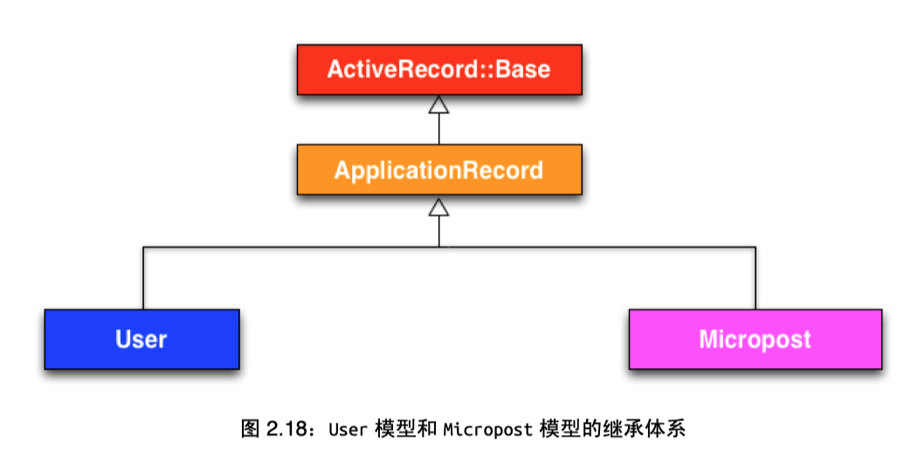
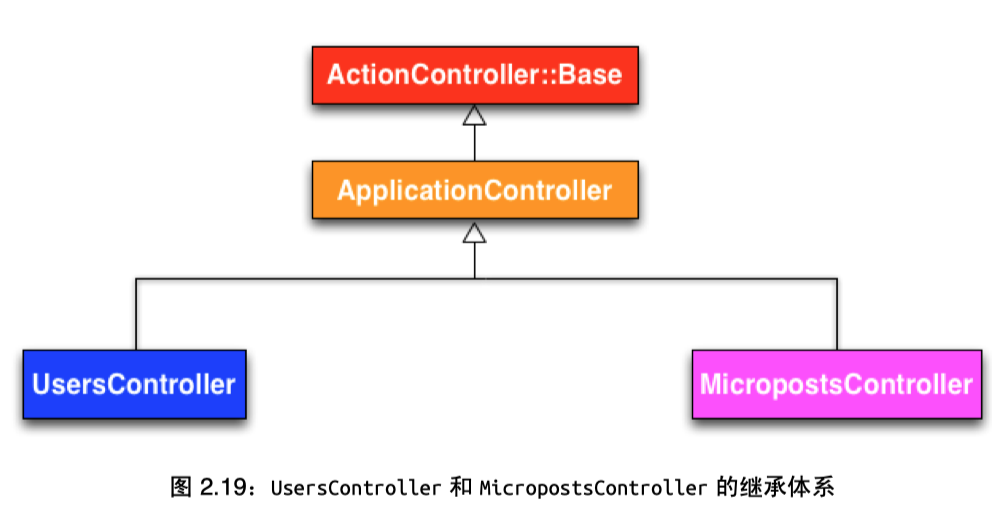
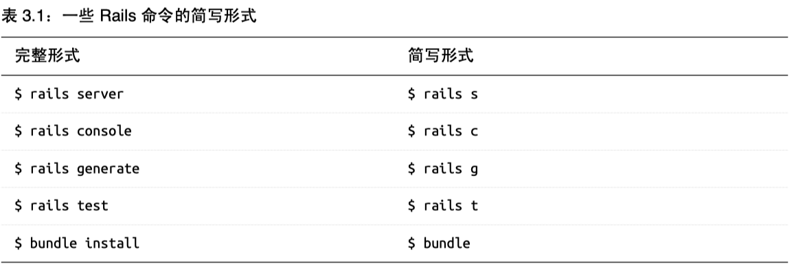

# Ruby On Rails Tutorial 4th Study Note

这个笔记按照Ruby On Rails Tutorial 4th来制作一个app

# C2 玩具应用

## 安装指定版本的rails

`gem install rails -v 5.1.4`

`rails _5.1.4_ new hello_app`

## Gemfile的语法
`gem 'uglifier', '>= 1.3.0'`
指的是安装大于等于1.3.0的最新版本

`gem 'coffee-rails', '~> 4.0.0'`
指的是安装大于4.0.0，但小于4.1的版本

Modifi the gem file and specify the version of each file
```ruby
source 'https://rubygems.org'

git_source(:github) do |repo_name|
  repo_name = "#{repo_name}/#{repo_name}" unless repo_name.include?("/")
  "https://github.com/#{repo_name}.git"
end


# Bundle edge Rails instead: gem 'rails', github: 'rails/rails'
gem 'rails', '5.1.4'
# Use sqlite3 as the database for Active Record
# gem 'sqlite3'
# Use Puma as the app server
gem 'puma', '3.9.1'
# Use SCSS for stylesheets
gem 'sass-rails', '5.0.6'
# Use Uglifier as compressor for JavaScript assets
gem 'uglifier', '3.2.0'
# See https://github.com/rails/execjs#readme for more supported runtimes
# gem 'therubyracer', platforms: :ruby

# Use CoffeeScript for .coffee assets and views
gem 'coffee-rails', '4.2.2'
# Turbolinks makes navigating your web application faster. Read more: https://github.com/turbolinks/turbolinks
gem 'turbolinks', '5.0.1'
# Build JSON APIs with ease. Read more: https://github.com/rails/jbuilder
gem 'jbuilder', '2.7.0'
# Use Redis adapter to run Action Cable in production
# gem 'redis', '~> 3.0'
# Use ActiveModel has_secure_password
# gem 'bcrypt', '~> 3.1.7'

# Use Capistrano for deployment
# gem 'capistrano-rails', group: :development

group :development, :test do
  gem 'sqlite3', '1.3.13'
  # Call 'byebug' anywhere in the code to stop execution and get a debugger console
  gem 'byebug', '9.0.6', platforms: :mri
  # Adds support for Capybara system testing and selenium driver
  # gem 'capybara', '~> 2.13'
  # gem 'selenium-webdriver'
end

group :development do
  # Access an IRB console on exception pages or by using <%= console %> anywhere in the code.
  gem 'web-console', '3.5.1'
  gem 'listen', '3.0.8'
  # Spring speeds up development by keeping your application running in the background. Read more: https://github.com/rails/spring
  gem 'spring', '2.0.2'
  gem 'spring-watcher-listen', '2.0.1'
end

group :production do
  gem 'pg', '0.20.0'
end

# Windows does not include zoneinfo files, so bundle the tzinfo-data gem
gem 'tzinfo-data', platforms: [:mingw, :mswin, :x64_mingw, :jruby]

```

After change the Gemfile, run:

`bundle update`

`bundle install --without production`

## Add hello
see P59

## User资源 模型
使用脚手架生成User model

`rails generate scaffold User name:string email:string`

we have
```
Running via Spring preloader in process 11948
      invoke  active_record
      create    db/migrate/20190312030845_create_users.rb
      create    app/models/user.rb
      invoke    test_unit
      create      test/models/user_test.rb
      create      test/fixtures/users.yml
      invoke  resource_route
       route    resources :users
      invoke  scaffold_controller
      create    app/controllers/users_controller.rb
      invoke    erb
      create      app/views/users
      create      app/views/users/index.html.erb
      create      app/views/users/edit.html.erb
      create      app/views/users/show.html.erb
      create      app/views/users/new.html.erb
      create      app/views/users/_form.html.erb
      invoke    test_unit
      create      test/controllers/users_controller_test.rb
      invoke    helper
      create      app/helpers/users_helper.rb
      invoke      test_unit
      invoke    jbuilder
      create      app/views/users/index.json.jbuilder
      create      app/views/users/show.json.jbuilder
      create      app/views/users/_user.json.jbuilder
      invoke  test_unit
      create    test/system/users_test.rb
      invoke  assets
      invoke    coffee
      create      app/assets/javascripts/users.coffee
      invoke    scss
      create      app/assets/stylesheets/users.scss
      invoke  scss
      create    app/assets/stylesheets/scaffolds.scss
```

Database migrate, run:

`rails db:migrate`

在 Rails 5 之前，Ruby on Rails 大量使用 Rake，因此为了维护以前的应用，一定要知道如何使用 Rake。 或许，Rails 最常使用的两个 Rake 命令是 rake db:migrate（迁移数据库，更新数据模型）和 rake test（运行自动化测试组件）。使用 Rake 时，要确保使用的是 Rails 应用 Gemfile 文件中指定的版本， 方法是使用 Bundler 提供的 bundle exec 命令。因此，执行迁移的 rails db:migrate 命令要写成：

`bundle exec rake db:migrate`

In app/models/user.rb:
```ruby
class User < ApplicationRecord
end
```
In app/controllers/users_controller.rb:

```ruby
def index
  @users = User.all
end
```
通过继承Active Record具备了许多功能，比如User.all可以返回所有用户。

## Microposts资源
继续使用脚手架生成代码

`rails generate scaffold Micropost content:text user_id:integer`





```
Running via Spring preloader in process 14360
      invoke  active_record
      create    db/migrate/20190312043113_create_microposts.rb
      create    app/models/micropost.rb
      invoke    test_unit
      create      test/models/micropost_test.rb
      create      test/fixtures/microposts.yml
      invoke  resource_route
       route    resources :microposts
      invoke  scaffold_controller
      create    app/controllers/microposts_controller.rb
      invoke    erb
      create      app/views/microposts
      create      app/views/microposts/index.html.erb
      create      app/views/microposts/edit.html.erb
      create      app/views/microposts/show.html.erb
      create      app/views/microposts/new.html.erb
      create      app/views/microposts/_form.html.erb
      invoke    test_unit
      create      test/controllers/microposts_controller_test.rb
      invoke    helper
      create      app/helpers/microposts_helper.rb
      invoke      test_unit
      invoke    jbuilder
      create      app/views/microposts/index.json.jbuilder
      create      app/views/microposts/show.json.jbuilder
      create      app/views/microposts/_micropost.json.jbuilder
      invoke  test_unit
      create    test/system/microposts_test.rb
      invoke  assets
      invoke    coffee
      create      app/assets/javascripts/microposts.coffee
      invoke    scss
      create      app/assets/stylesheets/microposts.scss
      invoke  scss
   identical    app/assets/stylesheets/scaffolds.scss
```

Then, run:

`rails db:migrate`

## 限制微博长度
add this to app/models/micropost.rb:

`validates :content, length: { maximum: 140 }`

## 在micropost and user之间建立关联
in models/micropost.rb:

```ruby
class Micropost < ApplicationRecord
  belongs_to :user
  validates :content, length: { maximum: 140 }
end
```

in models/user.rb:

```ruby
class User < ApplicationRecord
  has_many :microposts
end
```




User rails console to see:

```
➜  toy_app git:(master) ✗ rails console
Running via Spring preloader in process 14781
Loading development environment (Rails 5.1.4)
2.4.0 :001 > first_user = User.first
  User Load (0.1ms)  SELECT  "users".* FROM "users" ORDER BY "users"."id" ASC LIMIT ?  [["LIMIT", 1]]
 => #<User id: 1, name: "Yixu Chen", email: "chenyixu1996@tamu.edu", created_at: "2019-03-12 04:28:26", updated_at: "2019-03-12 04:28:26">
2.4.0 :002 > first_user.microposts
  Micropost Load (0.1ms)  SELECT  "microposts".* FROM "microposts" WHERE "microposts"."user_id" = ? LIMIT ?  [["user_id", 1], ["LIMIT", 11]]
 => #<ActiveRecord::Associations::CollectionProxy [#<Micropost id: 1, content: "First micropost", user_id: 1, created_at: "2019-03-12 04:34:40", updated_at: "2019-03-12 04:34:40">, #<Micropost id: 2, content: "2nd, bulabula", user_id: 1, created_at: "2019-03-12 04:34:52", updated_at: "2019-03-12 04:34:52">]>
2.4.0 :003 > micropost = first_user.microposts.first
  Micropost Load (0.1ms)  SELECT  "microposts".* FROM "microposts" WHERE "microposts"."user_id" = ? ORDER BY "microposts"."id" ASC LIMIT ?  [["user_id", 1], ["LIMIT", 1]]
 => #<Micropost id: 1, content: "First micropost", user_id: 1, created_at: "2019-03-12 04:34:40", updated_at: "2019-03-12 04:34:40">
2.4.0 :004 > micropost.user
 => #<User id: 1, name: "Yixu Chen", email: "chenyixu1996@tamu.edu", created_at: "2019-03-12 04:28:26", updated_at: "2019-03-12 04:28:26">
2.4.0 :005 > exit
```
## 验证微博内容和用户邮箱存在性
```ruby
class User < ApplicationRecord
  has_many :microposts
  validates :name, presence: true
  validates :email, presence: true
end
```

```ruby
class Micropost < ApplicationRecord
  belongs_to :user
  validates :content, length: { maximum: 140 }, presence: true
end
```

## 继承体系

Model的继承



Controller的继承




# C3 基本静态的页面

## Create app

和C2一样建立新的app，修改gemfile如下：

```ruby
source 'https://rubygems.org'

git_source(:github) do |repo_name|
  repo_name = "#{repo_name}/#{repo_name}" unless repo_name.include?("/")
  "https://github.com/#{repo_name}.git"
end


# Bundle edge Rails instead: gem 'rails', github: 'rails/rails'
gem 'rails', '5.1.4'
# Use sqlite3 as the database for Active Record
# gem 'sqlite3'
# Use Puma as the app server
gem 'puma', '3.9.1'
# Use SCSS for stylesheets
gem 'sass-rails', '5.0.6'
# Use Uglifier as compressor for JavaScript assets
gem 'uglifier', '3.2.0'
# See https://github.com/rails/execjs#readme for more supported runtimes
# gem 'therubyracer', platforms: :ruby

# Use CoffeeScript for .coffee assets and views
gem 'coffee-rails', '4.2.2'
# Turbolinks makes navigating your web application faster. Read more: https://github.com/turbolinks/turbolinks
gem 'turbolinks', '5.0.1'
# Build JSON APIs with ease. Read more: https://github.com/rails/jbuilder
gem 'jbuilder', '2.7.0'
# Use Redis adapter to run Action Cable in production
# gem 'redis', '~> 3.0'
# Use ActiveModel has_secure_password
# gem 'bcrypt', '~> 3.1.7'

# Use Capistrano for deployment
# gem 'capistrano-rails', group: :development

group :development, :test do
  gem 'sqlite3', '1.3.13'
  # Call 'byebug' anywhere in the code to stop execution and get a debugger console
  gem 'byebug', '9.0.6', platforms: :mri
  # Adds support for Capybara system testing and selenium driver
  # gem 'capybara', '~> 2.13'
  # gem 'selenium-webdriver'
end

group :development do
  # Access an IRB console on exception pages or by using <%= console %> anywhere in the code.
  gem 'web-console', '3.5.1'
  gem 'listen', '3.0.8'
  # Spring speeds up development by keeping your application running in the background. Read more: https://github.com/rails/spring
  gem 'spring', '2.0.2'
  gem 'spring-watcher-listen', '2.0.1'
end

group :test do
  gem 'rails-controller-testing', '1.0.2'
  gem 'minitest-reporters', '1.1.14'
  gem 'guard', '2.13.0'
  gem 'guard-minitest', '2.4.4'
end

group :production do
  gem 'pg', '0.20.0'
end

# Windows does not include zoneinfo files, so bundle the tzinfo-data gem
gem 'tzinfo-data', platforms: [:mingw, :mswin, :x64_mingw, :jruby]

```

## Add hello world

skip

## 静态页面

最好在新的分支里工作

`git checkout -b static-pages`

控制器的名字使用驼峰式命名法。

我们计划创建“首页”、 “帮助”页面和“关于”页面，对应的动作名分别为 home、help 和 about。

创建控制器StaticPages，generate 命令可以接收一个可选的参 数列表，指定要创建的动作

`rails generate controller StaticPages home help`

注意，我们传入的控制器名使用驼峰式（因为像骆驼的双峰一样），创建的控制器文件名则是蛇底式。所以，传入“StaticPages”得到的文件是 static_pages_controller.rb

```ruby
➜  sample_app git:(static-pages) rails generate controller StaticPages home help
Running via Spring preloader in process 16329
      create  app/controllers/static_pages_controller.rb
       route  get 'static_pages/help'
       route  get 'static_pages/home'
      invoke  erb
      create    app/views/static_pages
      create    app/views/static_pages/home.html.erb
      create    app/views/static_pages/help.html.erb
      invoke  test_unit
      create    test/controllers/static_pages_controller_test.rb
      invoke  helper
      create    app/helpers/static_pages_helper.rb
      invoke    test_unit
      invoke  assets
      invoke    coffee
      create      app/assets/javascripts/static_pages.coffee
      invoke    scss
      create      app/assets/stylesheets/static_pages.scss
```

rails可以使用简写命令



## rails撤销操作

即使再小心，在开发 Rails 应用的过程中也可能会犯错。幸好 Rails 提供了一些工具能够帮助我们还原操作。

举例来说，一个常见的情况是更改控制器的名字，这时你得删除生成的文件。生成控制器时，除了控制器文件本身之外，Rails 还会生成很多其他文件。撤销生成的文件不仅仅要删除控制器文件，还要删除不少辅助文件（在 rails generate 命令还会自动修改 routes.rb 文件，因此我们也想自动撤销这些修改）

在 Rails 中，可以使用 rails destroy 命令完成撤销操作。

一般来说，下面这两个命令是相互抵消的：

```ruby
$ rails generate controller StaticPages home help
$ rails destroy controller StaticPages home help

$ rails generate model User name:string email:string
$ rails destroy model User # 这里，我们可以省略命令行中其余的参数

$ rails db:migrate
$ rails db:rollback
$ rails db:migrate VERSION=0 #回到最开始，数字就是相应的版本
```

## 修改view

views/static_pages/home.html.erb

```html
<h1>Sample App</h1>
<p>
  This is the home page for the
  <a href="http://www.railstutorial.org/">Ruby on Rails Tutorial</a>
  sample application.
</p>

```

views/static_pages/help.html.erb

```ruby
<h1>Help</h1>
<p> Get help on the Ruby on Rails Tutorial at the
  <a href="http://www.railstutorial.org/help">Rails Tutorial help page</a>.
  To get help on this sample app, see the 
  <a href="http://www.railstutorial.org/book"><em>Ruby on Rails Tutorial</em> book</a>.
</p>
```

## 第一个测试


