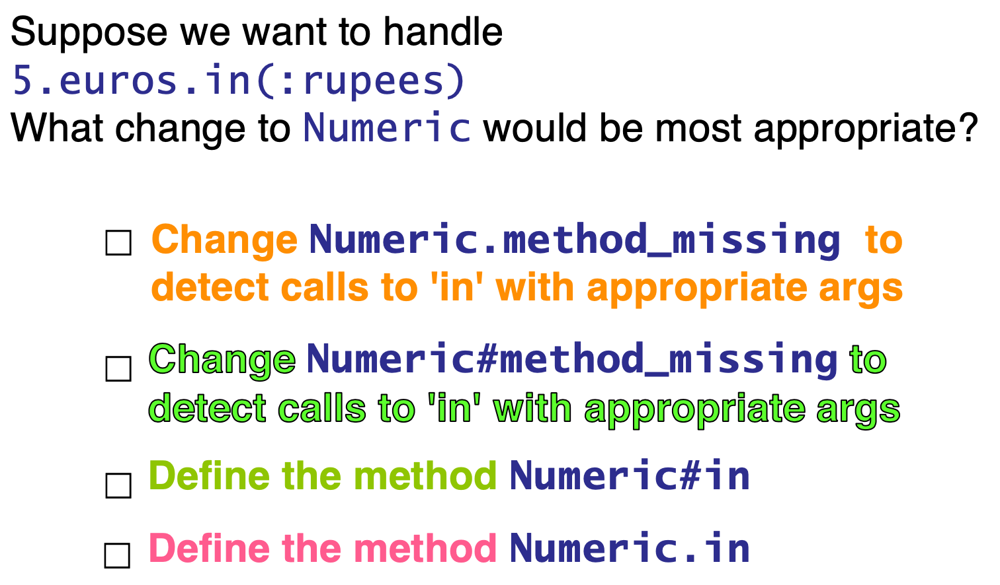
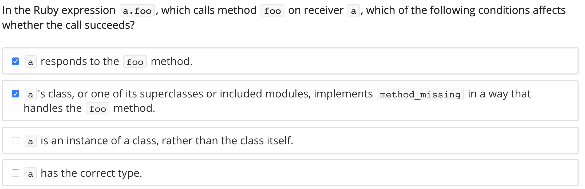

**Reflection**

You can ask Ruby objects questions about themselves at runtime (**introspection**)

You can use this information to generate new code (methods, objects, classes) at runtime (**reflection**)

**Metaprogramming**

so can have code that writes code (metaprogramming)

## Question
here are some bad example:

```ruby
acct.deposit(100)    # deposit $100
acct.deposit(euros_to_dollars(20))
acct.deposit(CurrencyConverter.new(:euros, 20))
```

Now let's see more beautiful code:

```ruby
acct.deposit(100)   	 # deposit $100
acct.deposit(20.euros)   # about $25
```

Here, euro have to be an **instance method** of the Numeric class. We open the class and define the method

```ruby
class Numeric
  def euros
    self * 1.3
  end
end
```

then what about this?? the singular version

```ruby
acct.deposit(1.euro)
```

or some other currencies

```ruby
acct.deposit(1000.yen)
acct.deposit(3000.rupees)
```

## Solution
**method_missing** is one way. method_missing get called before super is called.

method_missing is a **instance method**!

```ruby
# metaprogramming to the rescue!

class Numeric
  @@currencies = {'yen' => 0.013, 'euro' => 1.292, 'rupee' => 0.019}
  def method_missing(method_id, *args, &block)  # capture all args in case have to call super
    singular_currency = method_id.to_s.gsub( /s$/, '')
    if @@currencies.has_key?(singular_currency)
      self * @@currencies[singular_currency]
    else
      super
    end
  end
end

def self.add_currency(name,conversion)
  @@currencies[name.to_s] = conversion
end
```

**gsub** method substitutes the second string (null in this case) for all instances of the first string (“s” at end of currency name)

attr_accessor also generates new code at run time, creating on the fly getter and setter for instance variable.

## Exercises

**Q1**

Suppose we want to handle
`5.euros.in(:rupees)`

What change to Numeric would be most appropriate?

- Change `Numeric.method_missing` to detect calls to 'in' with appropriate args

- Change `Numeric#method_missing` to detect calls to 'in' with appropriate args

- Define the method `Numeric#in`

- Define the method `Numeric.in`


**Q2**



Numeric.in – “in” is a class method of Numeric

Numeric#in – “in” is an instance method of Numeric

1. No. Numeric.method_missing is the “missing method” method of the Numeric class, it applies to the class Numeric, not to an instance of Numeric, and 5.euros is an instance of Numeric.

2. Could do it. Could change Numeric#method_missing to detect calls to 'in', but why not make a new method?, Numeric#method_missing, an instance method of all Numeric instances, sent to an instance of Numeric

3. Yes. Create a new instance method “in”, that multiples the Numeric object by the appropriate conversion factor based on looking up the argument in a hash table.

4. No. Defining a new class method “in” would apply the conversion to the class, not an instance of the class Numeric.


**Q3**




# Ref

Read more [./1_attr_accessor.md](./1_attr_accessor.md) 
Read more [./3_MoreRuby.ppt]