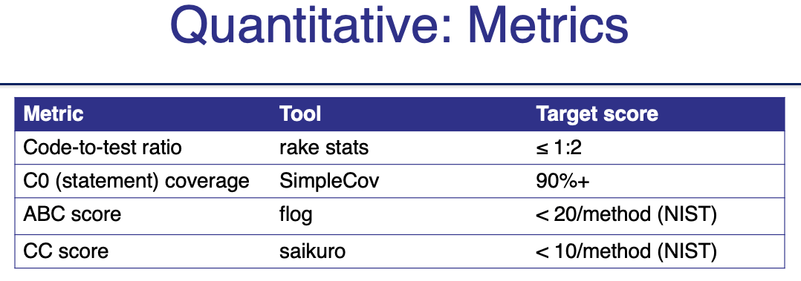
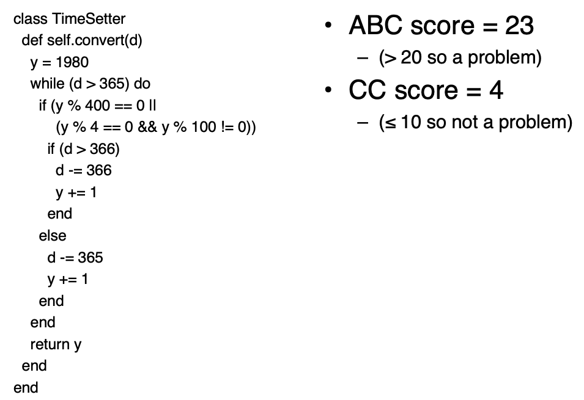
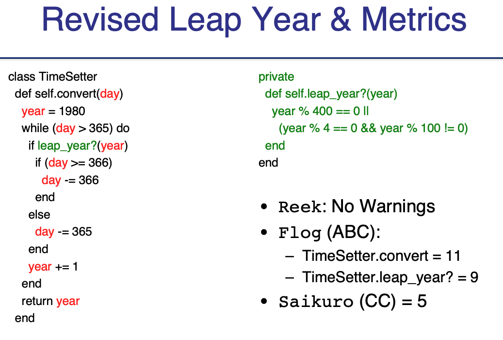

# SOFA

Is it **Short**?
Does it do **One** thing?
Does it have **Few** arguments?
Is it a consistent level of **Abstraction**?

Rails tool **reek** finds code smells

## ABC complexiy

Counts **Assignments**, **Branches**, **Conditions**

Complexity Score = $\sqrt{A^2 + B^2 + C^2}​$

NIST (Natl. Inst. Stds. & Tech.): ≤20/method
Rails tool **flog** checks ABC complexity

# Cyclomatic Complexity

number of linearly-independent paths thru code = E–N+2P (edges, nodes, connected components)

# Metrics

## Example

