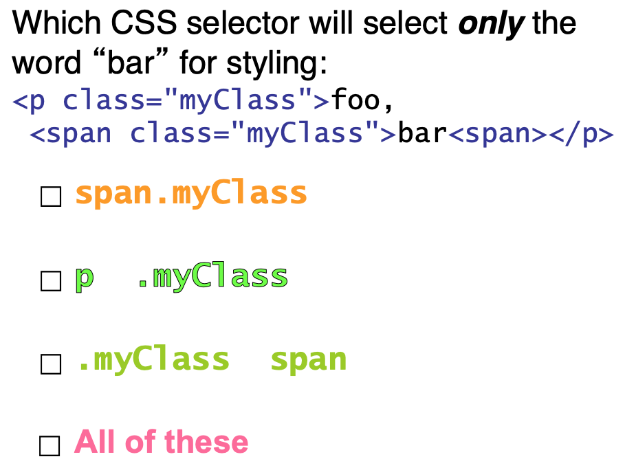
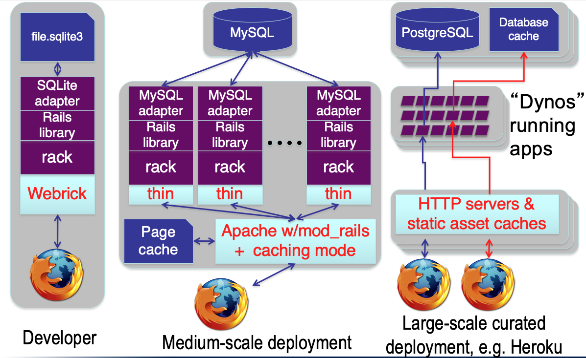
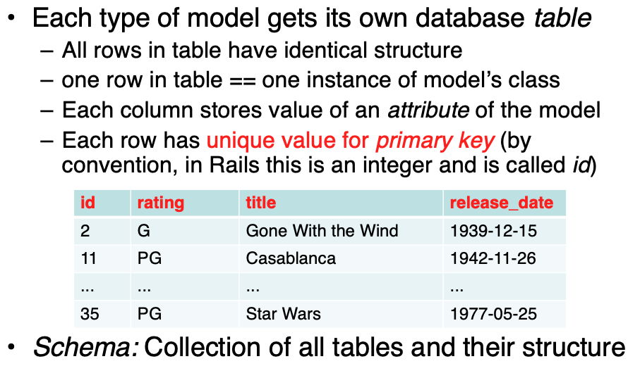
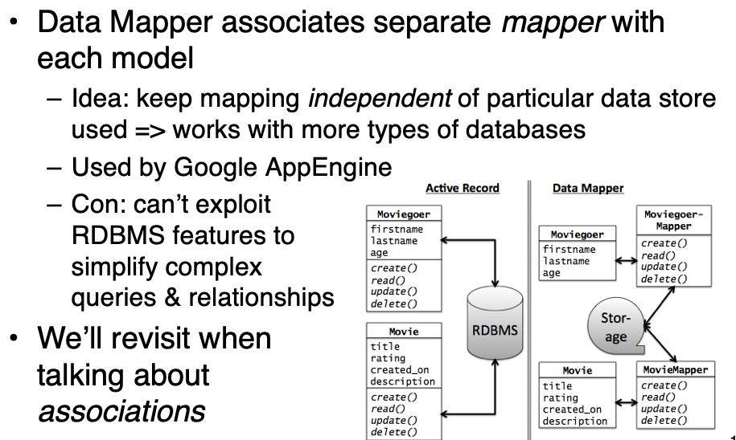

# C2.1-2.2
TCP/IP
DNS
HTTP
URL
stateless protocal
Cookies

# C2.3 HTTP and CSS
## HTML examle
Goal: HTML markup contains no visual styling information

```html
<div class="pageFrame" id="pageHead">
  <h1>Welcome,
    <span id="custName">Hank</span>
  </h1>
  
</div>
```

## CSS selector
tag name: `h1`

class name: `.pageFrame`

element ID: `#pageHead`

tag name & class: `div.pageFrame`

tag name & id: `img#welcome` (usually redundant)

descendant relationship: `div #custName`

Attributes inherit browser defaults unless overridden


## Exercise

### Q1



All are True

Span is an element used to group several HTML elements.

“element1.class1” will select element1 with class1. “element1#id1” will select element1 with id1. “element1 element2” will select element2 that is a child of element1. “element1, element2” will select element1 and element2. 

1. True. This will select the span element with class myClass, which contains bar.

2. True. This will select the paragraph, which contains foo and bar, and then the myClass element in the paragraph, which is the span with bar.

3. True. This will select all elements with class myClass, which is p and span, and then the span, which has bar.

4. True.

# C2.4 3-Tier Shared-Nothing Architecture & Scaling



## Presentation tier

Web Server (Apache, Microsoft IIS, WEBrick)

## Logic tier

App Server (rack)

## Presistence tier

Database (Postgres, SQLite)


Sharding vs. Replication


# C2.5 Model View Controller

# C2.6 Models, Databases, and Active Record

Basic operations on object: CRUD (Create, Read, Update, Delete)

ActiveRecord:
every model knows how to CRUD itself, using common mechanisms


Rails Models store data in Relational Databases (RDBMS)




Alternative: DataMapper



Data Mapper can reach much larger scale


# C2.7 Controller, Routes, and RESTfulness

**REST (Representational State Transfer)**

Idea: URI names resource, not page or action 

- Self-contained: which resource, and what to do to it
- Responses include hyperlinks to discover additional RESTful resources


# C2.8 Template View and Haml

**Template View**

**Transform View**


Haml is HTML on a Diet

```haml
%h1.pagename All Movies
%table#movies
  %thead
    %tr
      %th Movie Title
      %th Release Date
      %th More Info
  %tbody
    - @movies.each do |movie|
      %tr
        %td= movie.title 
        %td= movie.release_date
        %td= link_to "More on #{movie.title}",  |
        	movie_path(movie) |
= link_to 'Add new movie', new_movie_path
```

use indentation

"=" substitute  to the result

"\-" execute the code 

how to specify ID & class: `.class`, `#ID`

multi-line code use "|", deliberately awkward


## Don't Put code in your views

But MVC advocates thin views & controllers

Haml makes deliberately awkward to put in lots of code

Helpers (methods that “prettify” objects for including in views) have their own place in Rails app

