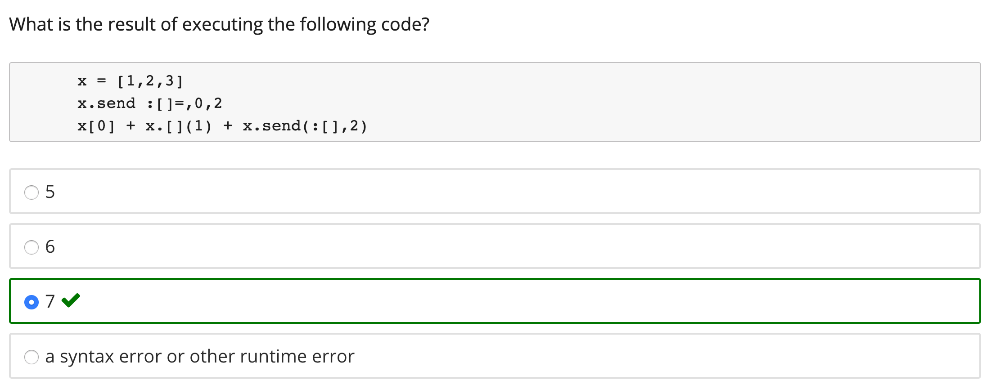

# Ruby OOP

Every thing is an object

## Send method

```ruby
1.send(:+, 2) 					# 1+2
my_array.send(:[], 4) 			# my_array[4]
my_array.send(:[]=, 3,"foo")	# my_array[3] = "foo"
if (x.send(:==, 3)) ...			# if(x==3)
self.send(:my_func, z)			# my_func(z)

```

a.b means: call method b on object a

a is the **receiver** to which you **send** the method call b, assuming a will **respond to** that method


**Example**




## Destructive method

Vast majority of methods create a copy of the object, but a few destructive ones
don't.

```ruby
y = [1,2]
y = y + ["foo",:bar]	# => [1,2,"foo",:bar]
y << 5               	# => [1,2,"foo",:bar,5]
y << [6,7]           	# => [1,2,"foo",:bar,5,[6,7]]
```

“<<”  *destructively modifies* its receiver, “+” does not

destructive methods often have names ending in “!”

## Method on different object

```ruby
y = 3 + 5
y = [1,2] + ["foo",:bar]
y = "hello" + "world"
```

So  3+5, "a"+"b", and [a,b]+[b,c] are all **different methods named '+'**

`Numeric#+`, `String#+`, and `Array#+`, to be specific


##  Hashes and Poetry Mode

```ruby
h = {"stupid" => 1, :example => "foo" }
h.has_key?("stupid") # => true
h["not a key"]     # => nil
h.delete(:example) # => "foo"
```

Ruby idiom: “poetry mode”
- using hashes to pass “keyword-like” arguments
- omit hash braces when **last** argument to function is hash
- omitting parentheses around function arguments 

```ruby
link_to("Edit”,{:controller=>'students', :action=>'edit'})
link_to "Edit", :controller=>'students', :action=>'edit'
link_to 'Edit', controller: 'students', action: 'edit'
```

Note that an alternate notation in hash functions is to eliminate the “=>” and put the colon at the end
of the key.

```ruby
a.should(be.send(:>=,7))
a.should(be() >= 7)
a.should be >= 7

(redirect_to(login_page)) and return() unless
	logged_in?
redirect_to login_page and return unless
	logged_in?
```


