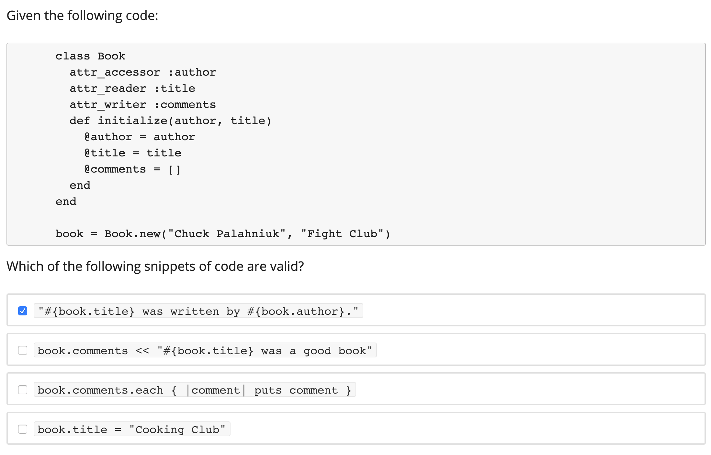

# Class and Inheritance

```ruby
class SavingsAccount < Account    # inheritance
  # constructor used when SavingsAccount.new(...) called 
  def initialize(starting_balance=0) # optional argument
    @balance = starting_balance
  end
  def balance	 # instance method
    @balance   # instance var: visible only to this object
  end
  def balance=(new_amount)  # note method name: like setter
    @balance = new_amount
  end
  def deposit(amount)
    @balance += amount
  end
  @@bank_name = "MyBank.com"    # class (static) variable  
  # A class method
  def self.bank_name   # note difference in method def, this is a class method
    @@bank_name
  end
  # or: def SavingsAccount.bank_name ; @@bank_name ; end
end

armando = Account.new(1000)
dave = Account.new(5000)
billg = Account.new(1e9)
```


# Shortcuts: Instance variables

```ruby
class SavingsAccount < Account   
  def initialize(starting_balance)
    @balance = starting_balance
  end 
  attr_accessor :balance
end
```

is the same as

```ruby
class SavingsAccount < Account   
  def initialize(starting_balance)
    @balance = starting_balance
  end 
  def balance
    @balance     
  end
  def balance=(new_amount)  
    @balance = new_amount
  end
end

```


# Exercises
## Q1
Class `A` is a subclass of Class `B`. Class `B` is a subclass of class `C`. `a` is an object of class `A`. `b` is an object of class `B`. Which ONE of the following Ruby expressions is NOT true?

```ruby
b.respond_to?('class')
a.superclass == b.class # This is the answer
A.superclass == B
a.class.ancestors.include?(C)
```

(2) is confusing because when I input `a.superclass` into `irb`, I got `NoMethodError: undefined method 'superclass' for #<A:0x7fbdce1075f0>`.

But when I input `A.superclass == B` into the `irb`, I get `true`.


```ruby
class C
end

class B < C
end

class A < B
end

a = A.new
b = B.new

p b.class
p a.superclass


--output:--
B

1.rb:14:in `<main>': undefined method `superclass' for #<A:0x0000010109bc88> (NoMethodError)
```

First, the proper term is "an instance of A". The reason you can call superclass() on A is because ruby defines a class called Class, and Class defines the methods that can be called by class objects, which are instances of Class. All classes, e.g. A, are instances of Class. One of the methods defined in Class is superclass().

On the other hand, an instance of A is not a class, and therefore an instance of A cannot call methods defined in Class.

You might have read that "everything in ruby is an object" (which is not true, but in most cases it is). So A is an object (in addition to being a class). An object must be an instance of some class, and it so happens that A is an instance of Class. Therefore, A can call the methods defined in Class.

## Q2

Which of the following statements about classes in Ruby are true?

1. `Array` is an instance of `Class`.
2. When `self` is used within the definition of an instance method, it refers to the current instance of the class.
3. Ruby supports multiple inheritance.
4. Public methods of a class cannot be redefined after an instance of that class is instantiated.


**Array.is_a? Class**

First of all, Array *is* a class, but doesn't inherit from Class or have Class in its ancestry. Consider:

```ruby
Array.is_a? Class
# => true

Array.ancestors
# => [Array, Enumerable, Object, PP::ObjectMixin, Kernel, BasicObject]

Array < Class
# => nil
```

On the other hand, Array is an *instance* of Class:

```ruby
Array.instance_of? Class
# => true
```

So, while Array doesn't inherit from Class in its ancestry chain, it is (strictly speaking) an instance of a Class. That makes #1 technically correct.

1 and 2 are correct answer

## Q3



```ruby
class Book
  attr_accessor :author
  attr_reader :title
  attr_writer :comments
  # attr_reader :comments
  def initialize(author, title)
    @author = author
    @title = title
    @comments = []
  end
end

book = Book.new("Chuck Palahniuk", "Fight Club")
book.comments << "#{book.title} was a good book" # error, need a reader instead of a writter
puts book.comments
```